## Library

``` r
library(dplyr)
```

    ## 
    ## Attaching package: 'dplyr'

    ## The following objects are masked from 'package:stats':
    ## 
    ##     filter, lag

    ## The following objects are masked from 'package:base':
    ## 
    ##     intersect, setdiff, setequal, union

``` r
library(readr)
library(purrr)
library(GGally)
```

    ## Carregando pacotes exigidos: ggplot2

    ## Registered S3 method overwritten by 'GGally':
    ##   method from   
    ##   +.gg   ggplot2

``` r
library(pscl)
```

    ## Classes and Methods for R developed in the
    ## Political Science Computational Laboratory
    ## Department of Political Science
    ## Stanford University
    ## Simon Jackman
    ## hurdle and zeroinfl functions by Achim Zeileis

``` r
library(broom)
library(tidyverse)
```

    ## ── Attaching packages ─────────────────────────────────────── tidyverse 1.3.1 ──

    ## ✔ tibble  3.1.7     ✔ stringr 1.4.0
    ## ✔ tidyr   1.2.0     ✔ forcats 0.5.1

    ## ── Conflicts ────────────────────────────────────────── tidyverse_conflicts() ──
    ## ✖ dplyr::filter() masks stats::filter()
    ## ✖ dplyr::lag()    masks stats::lag()

``` r
library(modelr)
```

    ## 
    ## Attaching package: 'modelr'

    ## The following object is masked from 'package:broom':
    ## 
    ##     bootstrap

``` r
library(here)
```

    ## here() starts at /home/alysson/Laryssa-Mestrado/reproducao-FPCC2

``` r
library(skimr)
library(gcookbook)
library(lubridate)
```

    ## 
    ## Attaching package: 'lubridate'

    ## The following objects are masked from 'package:base':
    ## 
    ##     date, intersect, setdiff, union

## Lendo os CSVs e salvando em um dataframe

``` r
dado_2017 <- read_csv2("reproducao/2017-microdados-matriculas.csv")
```

    ## ℹ Using "','" as decimal and "'.'" as grouping mark. Use `read_delim()` for more control.

    ## Rows: 1031798 Columns: 25
    ## ── Column specification ────────────────────────────────────────────────────────
    ## Delimiter: ";"
    ## chr (18): Cor / Raça, Dt Data Fim Previsto, Dt Data Inicio, Dt Ocorrencia Ma...
    ## dbl  (7): Carga Horaria, Carga Horaria Minima, Co Ciclo Matricula, Código de...
    ## 
    ## ℹ Use `spec()` to retrieve the full column specification for this data.
    ## ℹ Specify the column types or set `show_col_types = FALSE` to quiet this message.

``` r
dado_2017 <- dado_2017 %>% filter(`Tipo de Oferta`=="Integrado") %>%
  filter(`Tipo de Curso`=="Técnico") %>%
  filter(str_detect(`Instituição`, "^IF"))  %>%
  mutate(`Sg Sexo` = ifelse(`Sg Sexo`=="F", "Feminino", "Masculino"), ano = 2017) %>%
  rename(Sexo=`Sg Sexo`)

# TODO Exemplo para selecionar e renomar colunas com o dado de 2017. 
# É necessário que todos dos dataframes possuam as mesmas colunas com os mesmos nomes (diferenciar maiúsculo de minúsculo)
# dado_2017 <- dado_2017 %>% select(nome_curso = `Nome Curso`, Sexo)

dado_2018 <- read_csv2("reproducao/2018-microdados-matriculas.csv") 
```

    ## ℹ Using "','" as decimal and "'.'" as grouping mark. Use `read_delim()` for more control.
    ## Rows: 1031798 Columns: 25── Column specification ────────────────────────────────────────────────────────
    ## Delimiter: ";"
    ## chr (18): Cor / Raça, Dt Data Fim Previsto, Dt Data Inicio, Dt Ocorrencia Ma...
    ## dbl  (7): Carga Horaria, Carga Horaria Minima, Co Ciclo Matricula, Código da...
    ## ℹ Use `spec()` to retrieve the full column specification for this data.
    ## ℹ Specify the column types or set `show_col_types = FALSE` to quiet this message.

``` r
dado_2018 <- dado_2018 %>% filter(`Tipo de Oferta`=="Integrado") %>%
  filter(`Tipo de Curso`=="Técnico") %>%
  filter(str_detect(`Instituição`, "^IF"))  %>%
  mutate(`Sg Sexo` = ifelse(`Sg Sexo`=="F", "Feminino", "Masculino"), ano = 2018) %>% 
  rename(Sexo=`Sg Sexo`)

dado_2019 <- read_csv2("reproducao/2019-microdados-matriculas.csv")
```

    ## ℹ Using "','" as decimal and "'.'" as grouping mark. Use `read_delim()` for more control.
    ## Rows: 1023303 Columns: 54── Column specification ────────────────────────────────────────────────────────
    ## Delimiter: ";"
    ## chr (23): Categoria da Situação, Cor / Raça, Data de Inicio do Ciclo, Data d...
    ## dbl (31): Teste, Carga Horaria, Carga Horaria Minima, Código do Ciclo Matric...
    ## ℹ Use `spec()` to retrieve the full column specification for this data.
    ## ℹ Specify the column types or set `show_col_types = FALSE` to quiet this message.

``` r
dado_2019 <- dado_2019 %>% filter(`Tipo de Oferta`=="Integrado")%>%
  filter(`Tipo de Curso`=="Técnico") %>%
  filter(str_detect(`Instituição`, "^IF"))  %>%
  select(-Teste) %>% 
  mutate(ano = 2019)

dado_2020 <- read_csv2("reproducao/2020-microdados-matriculas.csv")
```

    ## ℹ Using "','" as decimal and "'.'" as grouping mark. Use `read_delim()` for more control.
    ## Rows: 1048575 Columns: 54── Column specification ────────────────────────────────────────────────────────
    ## Delimiter: ";"
    ## chr (24): Categoria de Situação, Cor/Raça, Data de Fim Previsto do Ciclo, Da...
    ## dbl (30): Carga Horaria, Carga Horaria Minima, Cod Unidade, Código da Matríc...
    ## ℹ Use `spec()` to retrieve the full column specification for this data.
    ## ℹ Specify the column types or set `show_col_types = FALSE` to quiet this message.

``` r
dado_2020 <- dado_2020 %>% filter(`Tipo de Oferta`=="Integrado") %>%
  filter(`Tipo de Curso`=="Técnico") %>%
  filter(str_detect(`Instituição`, "^IF"))  %>%
  mutate(Sexo = ifelse(Sexo=="F", "Feminino", "Masculino"), ano = 2020)

dado_2021 <- read_csv2("reproducao/2021-microdados-matriculas.csv")
```

    ## ℹ Using "','" as decimal and "'.'" as grouping mark. Use `read_delim()` for more control.
    ## Rows: 1048575 Columns: 54── Column specification ────────────────────────────────────────────────────────
    ## Delimiter: ";"
    ## chr (24): Categoria de Situação, Cor/Raça, Data de Fim Previsto do Ciclo, Da...
    ## dbl (30): Carga Horaria, Carga Horaria Minima, Cod Unidade, Código da Matríc...
    ## ℹ Use `spec()` to retrieve the full column specification for this data.
    ## ℹ Specify the column types or set `show_col_types = FALSE` to quiet this message.

``` r
dado_2021 <- dado_2021 %>% filter(`Tipo de Oferta`=="Integrado") %>%
  filter(`Tipo de Curso`=="Técnico") %>%
  filter(str_detect(`Instituição`, "^IF"))  %>%
  mutate(Sexo = ifelse(Sexo=="F", "Feminino", "Masculino"), ano = 2021)

dado <- bind_rows(dado_2017, dado_2018, dado_2019, dado_2020, dado_2021)


# print(dado_2017)
# print(dado_2018)
# print(dado_2019)
# print(dado_2020)
# print(dado_2021)

print(dado)
```

    ## # A tibble: 1,022,572 × 74
    ##    `Carga Horaria` `Carga Horaria Minima` `Co Ciclo Matricula` `Código de Matr…`
    ##              <dbl>                  <dbl>                <dbl>             <dbl>
    ##  1            3750                   1200              1943726          61383527
    ##  2            3750                   1200              1943726          61383529
    ##  3            3750                   1200              1943726          61383491
    ##  4            3750                   1200              1943726          61383495
    ##  5            3750                   1200              1943726          61383515
    ##  6            3750                   1200              1943726          61383503
    ##  7            3750                   1200              1943726          61383473
    ##  8            3750                   1200              1943726          61383519
    ##  9            3500                   1200              2151261          72127473
    ## 10            3500                   1200              2151261          72127389
    ## # … with 1,022,562 more rows, and 70 more variables: `Cor / Raça` <chr>,
    ## #   `Dt Data Fim Previsto` <chr>, `Dt Data Inicio` <chr>,
    ## #   `Dt Ocorrencia Matricula` <chr>, `Eixo Tecnologico` <chr>,
    ## #   `Fator Esforco Curso` <dbl>, `Mes De Ocorrencia` <chr>,
    ## #   `Modalidade Ensino` <chr>, `Nome Curso` <chr>,
    ## #   `Fonte de financiamento` <chr>, `Renda Familiar` <chr>, Instituição <chr>,
    ## #   Sexo <chr>, `Situação de Matrícula` <chr>, `Sub Eixo Tecnologico` <chr>, …

# Analisando os dados do *data frame* e fazendo ajustes

Nesse momento foram realizados ajustes nos nomes dos cursos, pois tinha
uma divergência entre a nomenclatura dos anos 2019 à 2021 em relação a
2017 e 2018; após o ajuste realizados apresentamos um gráfico mostrando
a concentração feminina e masculina nos cursos selecionados entre os
anos de 2017 à 2021.

``` r
#unique(dado$`Nome Curso`)
#unique(dado$`Eixo Tecnologico`)
cursos_selcionados <- c("Técnico em Agrimensura", "Técnico em Edificações", "Técnico em Eletroeletrônica", "Técnico em Informática")

dado_summary = dado %>%
  filter(`Nome Curso` %in% cursos_selcionados) %>%
  group_by(ano) %>% 
  mutate(nalunos = n()) %>% 
  group_by(ano, Sexo) %>% 
  summarise(percentual_por_sexo = n() / first(nalunos) * 100)
```

    ## `summarise()` has grouped output by 'ano'. You can override using the `.groups`
    ## argument.

``` r
ggplot(dado_summary, aes(x = as.factor(ano), y = percentual_por_sexo, fill = Sexo)) +
  geom_bar(stat = "identity", position = position_dodge()) +
  labs(title = "Percentual de alunas e alunos nos cursos selecionados", x = "Anos correspondentes", y = "Percentual de alunos(as) %") +
  geom_text(aes(label = format(round(percentual_por_sexo, 2), nsmall = 2)), vjust = 1.5, color = "black") +
  coord_flip()
```

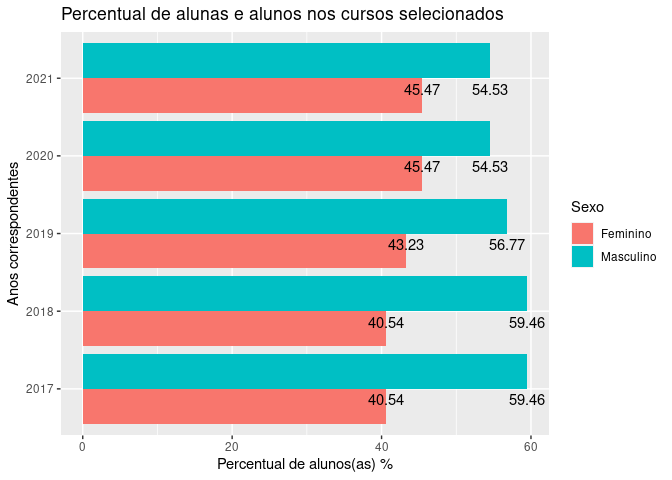

# 1.1 Ingresso Feminino nos Cursos da Pesquisa

Analisando o percentual de meninas para os cursos base desse pesquisa.

``` r
cursos_selcionados <- c("Técnico em Agrimensura", "Técnico em Edificações", "Técnico em Eletroeletrônica", "Técnico em Informática")

dado_summary = dado %>%
  filter(`Nome Curso` %in% cursos_selcionados) %>%
  filter(Sexo == "Feminino") %>%
  group_by(ano) %>% 
  mutate(nalunos = n()) %>% 
  group_by(ano, `Nome Curso`) %>% 
  summarise(percentual_por_sexo = n() / first(nalunos) * 100)
```

    ## `summarise()` has grouped output by 'ano'. You can override using the `.groups`
    ## argument.

``` r
ggplot(dado_summary, aes(x = as.factor(ano), y = percentual_por_sexo, fill = `Nome Curso`)) +
  geom_bar(stat = "identity", position = position_dodge()) +
  labs(title = "Percentual de alunas nos cursos selecionados", x = "", y = "") +
  geom_text(aes(label = format(round(percentual_por_sexo, 0), nsmall = 0)), vjust = -0.2, color = "black", position = position_dodge(width = 0.9))
```

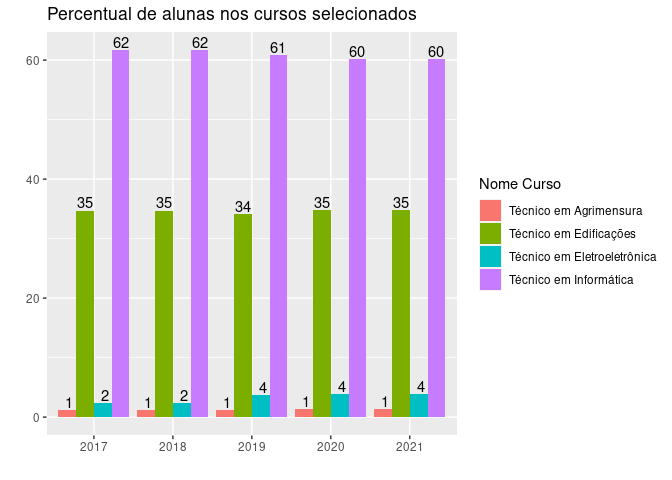

Analisando o percentual de meninos para os cursos base desse pesquisa.

``` r
cursos_selcionados <- c("Técnico em Agrimensura", "Técnico em Edificações", "Técnico em Eletroeletrônica", "Técnico em Informática")

dado_summary = dado %>%
  filter(`Nome Curso` %in% cursos_selcionados) %>%
  filter(str_detect(`Instituição`, "^IF")) %>%
  filter(Sexo == "Masculino") %>%
  group_by(ano) %>% 
  mutate(nalunos = n()) %>% 
  group_by(ano, `Nome Curso`) %>% 
  summarise(percentual_por_sexo = n() / first(nalunos) * 100)
```

    ## `summarise()` has grouped output by 'ano'. You can override using the `.groups`
    ## argument.

``` r
ggplot(dado_summary, aes(x = as.factor(ano), y = percentual_por_sexo, fill = `Nome Curso`)) +
  geom_bar(stat = "identity", position = position_dodge()) +
  labs(title = "Percentual de alunos nos cursos selecionados", x = "", y = "") +
  geom_text(aes(label = format(round(percentual_por_sexo, 0), nsmall = 0)), vjust = -0.2, color = "black", position = position_dodge(width = 0.9))
```

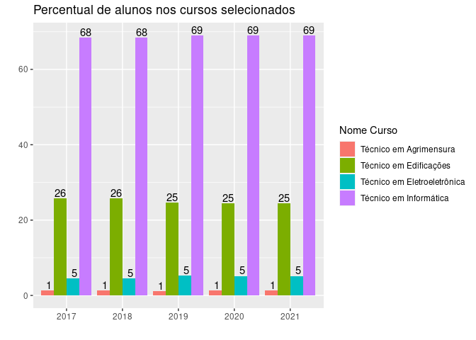

# Percentual Feminino a partir dos Eixos Tecnológicos

Agora vamos análise o percentual feminino e depois o masculino nos
respectivos Eixos tecnológicos: Infraestrutura, Informação e
Comunicação, Controle e Processos Industriais.

``` r
#unique(dado$Situa__O_Matricula)
#unique(dado$`Eixo Tecnologico`)
#unique(dado$Instituição)

eixo_tecnologico_selecionado <- c("Infraestrutura", "Informação e Comunicação", "Controle e Processos Industriais")

dado_summary = dado %>%
  filter(`Eixo Tecnologico` %in% eixo_tecnologico_selecionado) %>%
  group_by(ano, `Eixo Tecnologico`) %>% 
  mutate(nalunos = n()) %>% 
  group_by(ano, `Eixo Tecnologico`, Sexo) %>% 
  summarise(percentual_por_sexo = n() / first(nalunos) * 100) %>% 
  filter(Sexo == "Feminino")
```

    ## `summarise()` has grouped output by 'ano', 'Eixo Tecnologico'. You can override
    ## using the `.groups` argument.

``` r
ggplot(dado_summary, aes(x = as.factor(ano), y = percentual_por_sexo, fill = `Eixo Tecnologico`)) +
  geom_bar(stat = "identity", position = position_dodge()) +
  labs(title = "Percentual de alunas nos Eixos Tecnológicos selecionados", x = "", y = "Percentual de alunas %") +
  geom_text(aes(label = format(round(percentual_por_sexo, 0), nsmall = 0)), vjust = 1.5, color = "black", position = position_dodge(width = 0.9))
```

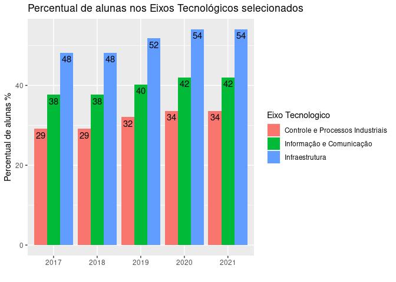

``` r
#unique(dado$Situa__O_Matricula)
#unique(dado$`Eixo Tecnologico`)
#unique(dado$Instituição)

eixo_tecnologico_selecionado <- c("Infraestrutura", "Informação e Comunicação", "Controle e Processos Industriais")

dado_summary = dado %>%
  filter(`Eixo Tecnologico` %in% eixo_tecnologico_selecionado) %>%
  group_by(ano, `Eixo Tecnologico`) %>% 
  mutate(nalunos = n()) %>% 
  group_by(ano, `Eixo Tecnologico`, Sexo) %>% 
  summarise(percentual_por_sexo = n() / first(nalunos) * 100) %>% 
  filter(Sexo == "Masculino")
```

    ## `summarise()` has grouped output by 'ano', 'Eixo Tecnologico'. You can override
    ## using the `.groups` argument.

``` r
ggplot(dado_summary, aes(x = as.factor(ano), y = percentual_por_sexo, fill = `Eixo Tecnologico`)) +
  geom_bar(stat = "identity", position = position_dodge()) +
  labs(title = "Percentual de alunos nos Eixos Tecnológicos selecionados", x = "", y = "") +
  geom_text(aes(label = format(round(percentual_por_sexo, 0), nsmall = 0)), vjust = 1.5, color = "black", position = position_dodge(width = 0.9))
```

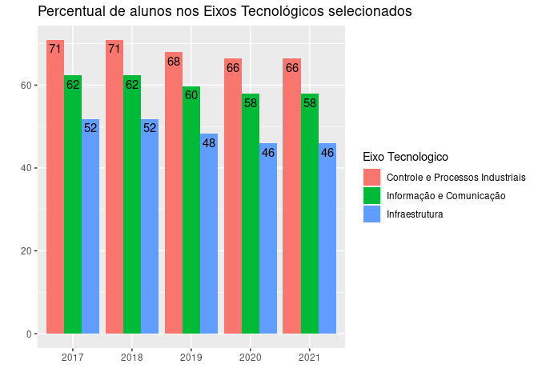

Análisando o percentual feminino para os demais Eixos Tecnológicos.

``` r
#unique(dado$`Eixo Tecnologico`)

#eixo_tecnologico_selecionado <- c("Infraestrutura", "Informação e Comunicação", "Controle e Processos Industriais")
eixo_tecnologico_selecionado <- c("Gestão e Negócios", "Ambiente e Saúde", "Recursos Naturais", "Turismo, Hospitalidade e Lazer",  "Produção Industrial", "Produção Cultural e Design", "Segurança", "Produção Alimentícia", "Desenvolvimento Educacional e Social")

dado_summary = dado %>%
  filter(`Eixo Tecnologico` %in% eixo_tecnologico_selecionado) %>%
  group_by(ano, `Eixo Tecnologico`) %>% 
  mutate(nalunos = n()) %>% 
  group_by(ano, `Eixo Tecnologico`, Sexo) %>% 
  summarise(percentual_por_sexo = n() / first(nalunos) * 100) %>% 
  filter(Sexo == "Feminino")
```

    ## `summarise()` has grouped output by 'ano', 'Eixo Tecnologico'. You can override
    ## using the `.groups` argument.

``` r
ggplot(dado_summary, aes(x = ano, y = percentual_por_sexo, fill = `Eixo Tecnologico`)) +
  geom_bar(stat = "identity", position = position_dodge()) +
  labs(title = "Percentual de alunas nos Eixos Tecnológicos selecionados", x = "", y = "") +
  geom_text(aes(label = format(round(percentual_por_sexo, 0), nsmall = 0)), vjust = 1.5, color = "black", position = position_dodge(width = 0.9))
```

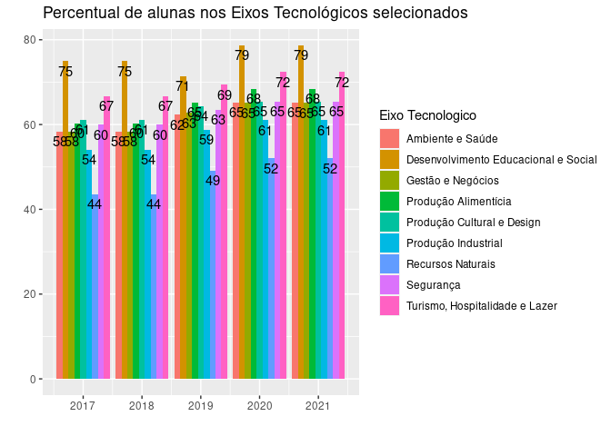

``` r
#unique(dado$`Eixo Tecnologico`)

#eixo_tecnologico_selecionado <- c("Infraestrutura", "Informação e Comunicação", "Controle e Processos Industriais")
eixo_tecnologico_selecionado <- c("Gestão e Negócios", "Ambiente e Saúde", "Recursos Naturais", "Turismo, Hospitalidade e Lazer",  "Produção Industrial", "Produção Cultural e Design", "Segurança", "Produção Alimentícia", "Desenvolvimento Educacional e Social")

dado_summary = dado %>%
  filter(`Eixo Tecnologico` %in% eixo_tecnologico_selecionado) %>%
  group_by(ano, `Eixo Tecnologico`) %>% 
  mutate(nalunos = n()) %>% 
  group_by(ano, `Eixo Tecnologico`, Sexo) %>% 
  summarise(percentual_por_sexo = n() / first(nalunos) * 100) %>% 
  filter(Sexo == "Masculino")
```

    ## `summarise()` has grouped output by 'ano', 'Eixo Tecnologico'. You can override
    ## using the `.groups` argument.

``` r
ggplot(dado_summary, aes(x = ano, y = percentual_por_sexo, fill = `Eixo Tecnologico`)) +
  geom_bar(stat = "identity", position = position_dodge()) +
  labs(title = "Percentual de alunos nos Eixos Tecnológicos selecionados", x = "", y = "") +
  geom_text(aes(label = format(round(percentual_por_sexo, 0), nsmall = 0)), vjust = 1.5, color = "black", position = position_dodge(width = 0.9))
```

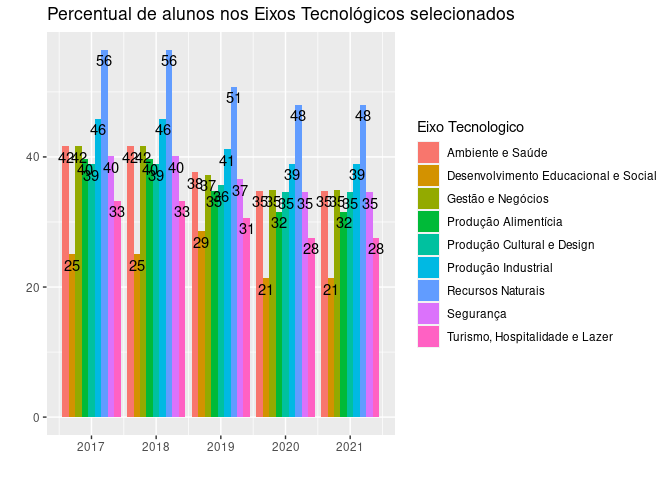

# 1.2 Interrupção dos Cursos pelas mulheres

``` r
#unique(dado$`Situação de Matricula`)
situacao_matricula <- c("Abandono", "Transf. externa", "Cancelada", "Desligada", "Transf. interna")
cursos_selcionados <- c("Técnico em Agrimensura", "Técnico em Edificações", "Técnico em Eletroeletrônica", "Técnico em Informática")

dado_summary = dado %>%
  filter(`Nome Curso` %in% cursos_selcionados) %>%
  filter(`Situação de Matrícula` %in% situacao_matricula) %>%
  group_by(ano, `Situação de Matrícula`, `Nome Curso`) %>% 
  mutate(nalunos = n()) %>% 
  group_by(ano, `Situação de Matrícula`, Sexo, `Nome Curso`) %>% 
  summarise(percentual_por_sexo = n() / first(nalunos) * 100) %>% 
  filter(Sexo == "Feminino")
```

    ## `summarise()` has grouped output by 'ano', 'Situação de Matrícula', 'Sexo'. You
    ## can override using the `.groups` argument.

``` r
#print(dado_summary)

# Trabalhando com o curso de Técnico em Técnico em Agrimensura

dado_agri <- dado_summary %>%
  filter(`Nome Curso` == "Técnico em Agrimensura") %>%
  group_by(`Situação de Matrícula`, percentual_por_sexo)

ggplot(dado_agri, aes(x = as.factor(ano), y = percentual_por_sexo, fill = `Situação de Matrícula`)) +
  geom_bar(stat = "identity", position = position_dodge()) +
  labs(title = "Percentual de evasão feminina no curso de Técnico em Agrimensura", x = "", y = "") +
  geom_text(aes(label = format(round(percentual_por_sexo, 0), nsmall = 0)), vjust = 1.5, color = "black", position = position_dodge(width = 0.9))
```

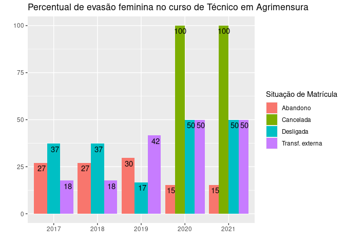

``` r
# Trabalhando com o curso de Técnico em Técnico em Edificações

dado_edi <- dado_summary %>%
  filter(`Nome Curso` == "Técnico em Edificações") %>%
  group_by(`Situação de Matrícula`, percentual_por_sexo)

ggplot(dado_edi, aes(x = as.factor(ano), y = percentual_por_sexo, fill = `Situação de Matrícula`)) +
  geom_bar(stat = "identity", position = position_dodge()) +
  labs(title = "Percentual de evasão feminina no curso de Técnico em Edificações", x = "", y = "") +
  geom_text(aes(label = format(round(percentual_por_sexo, 0), nsmall = 0)), vjust = 1.5, color = "black", position = position_dodge(width = 0.9))
```

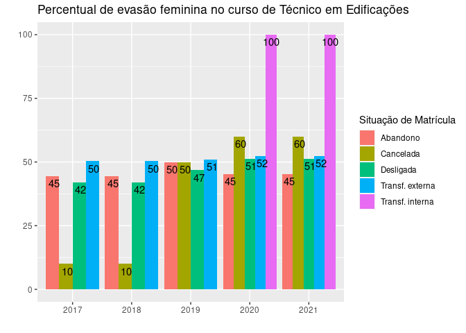

``` r
# Trabalhando com o curso de Técnico em Eletroeletrônica

dado_eletro <- dado_summary %>%
  filter(`Nome Curso` == "Técnico em Eletroeletrônica") %>%
  group_by(`Situação de Matrícula`, percentual_por_sexo)

ggplot(dado_eletro, aes(x = as.factor(ano), y = percentual_por_sexo, fill = `Situação de Matrícula`)) +
  geom_bar(stat = "identity", position = position_dodge()) +
  labs(title = "Percentual de evasão feminina no curso de Técnico em Eletroeletrônica", x = "", y = "") +
  geom_text(aes(label = format(round(percentual_por_sexo, 0), nsmall = 0)), vjust = 1.5, color = "black", position = position_dodge(width = 0.9))
```

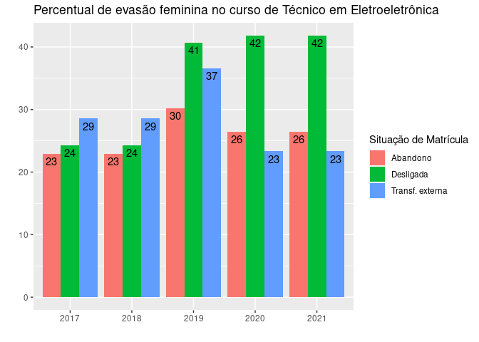

``` r
# Trabalhando com o curso de Técnico em Informática

dado_info <- dado_summary %>%
  filter(`Nome Curso` == "Técnico em Informática") %>%
  group_by(`Situação de Matrícula`, percentual_por_sexo)

ggplot(dado_info, aes(x = as.factor(ano), y = percentual_por_sexo, fill = `Situação de Matrícula`)) +
  geom_bar(stat = "identity", position = position_dodge()) +
  labs(title = "Percentual de evasão feminina no curso de Técnico em Informática", x = "", y = "") +
  geom_text(aes(label = format(round(percentual_por_sexo, 0), nsmall = 0)), vjust = 1.5, color = "black", position = position_dodge(width = 0.9))
```

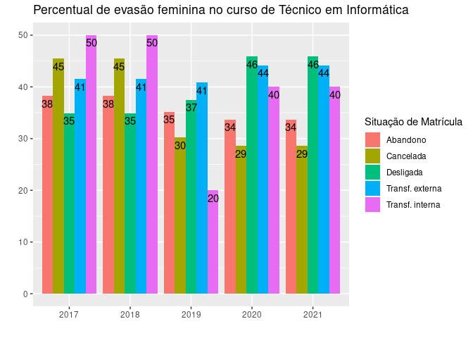

``` r
#unique(dado$`Situação de Matricula`)
situacao_matricula <- c("Abandono", "Transf. externa", "Cancelada", "Desligada", "Transf. interna")
cursos_selcionados <- c("Técnico em Agrimensura", "Técnico em Edificações", "Técnico em Eletroeletrônica", "Técnico em Informática")

dado_summary = dado %>%
  filter(`Nome Curso` %in% cursos_selcionados) %>%
  filter(`Situação de Matrícula` %in% situacao_matricula) %>%
  group_by(ano, `Situação de Matrícula`, `Nome Curso`) %>% 
  mutate(nalunos = n()) %>% 
  group_by(ano, `Situação de Matrícula`, Sexo, `Nome Curso`) %>% 
  summarise(percentual_por_sexo = n() / first(nalunos) * 100) %>% 
  filter(Sexo == "Masculino")
```

    ## `summarise()` has grouped output by 'ano', 'Situação de Matrícula', 'Sexo'. You
    ## can override using the `.groups` argument.

``` r
#print(dado_summary)

# Trabalhando com o curso de Técnico em Técnico em Agrimensura

dado_agri <- dado_summary %>%
  filter(`Nome Curso` == "Técnico em Agrimensura") %>%
  group_by(`Situação de Matrícula`, percentual_por_sexo)

ggplot(dado_agri, aes(x = as.factor(ano), y = percentual_por_sexo, fill = `Situação de Matrícula`)) +
  geom_bar(stat = "identity", position = position_dodge()) +
  labs(title = "Percentual de evasão masculina no curso de Técnico em Agrimensura", x = "", y = "") +
  geom_text(aes(label = format(round(percentual_por_sexo, 0), nsmall = 0)), vjust = 1.5, color = "black", position = position_dodge(width = 0.9))
```

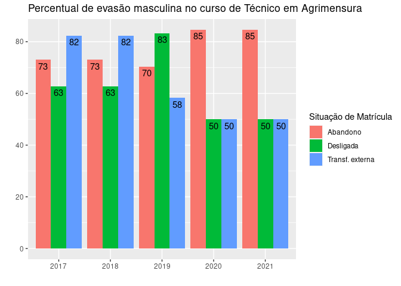

``` r
# Trabalhando com o curso de Técnico em Técnico em Edificações

dado_edi <- dado_summary %>%
  filter(`Nome Curso` == "Técnico em Edificações") %>%
  group_by(`Situação de Matrícula`, percentual_por_sexo)

ggplot(dado_edi, aes(x = as.factor(ano), y = percentual_por_sexo, fill = `Situação de Matrícula`)) +
  geom_bar(stat = "identity", position = position_dodge()) +
  labs(title = "Percentual de evasão masculina no curso de Técnico em Edificações", x = "", y = "") +
  geom_text(aes(label = format(round(percentual_por_sexo, 0), nsmall = 0)), vjust = 1.5, color = "black", position = position_dodge(width = 0.9))
```

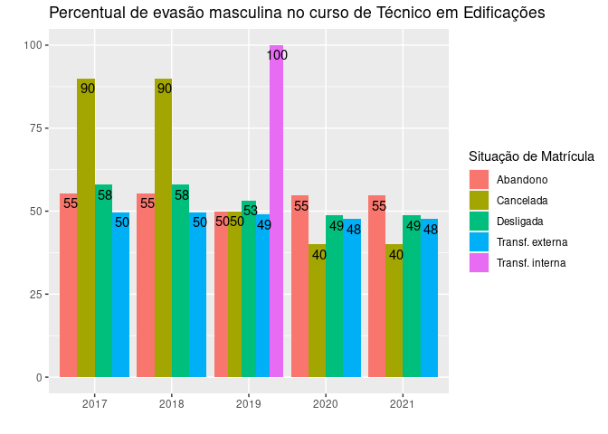

``` r
# Trabalhando com o curso de Técnico em Eletroeletrônica

dado_eletro <- dado_summary %>%
  filter(`Nome Curso` == "Técnico em Eletroeletrônica") %>%
  group_by(`Situação de Matrícula`, percentual_por_sexo)

ggplot(dado_eletro, aes(x = as.factor(ano), y = percentual_por_sexo, fill = `Situação de Matrícula`)) +
  geom_bar(stat = "identity", position = position_dodge()) +
  labs(title = "Percentual de evasão masculina no curso de Técnico em Eletroeletrônica", x = "", y = "") +
  geom_text(aes(label = format(round(percentual_por_sexo, 0), nsmall = 0)), vjust = 1.5, color = "black", position = position_dodge(width = 0.9))
```

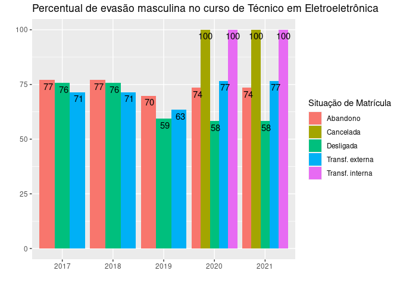

``` r
# Trabalhando com o curso de Técnico em Informática

dado_info <- dado_summary %>%
  filter(`Nome Curso` == "Técnico em Informática") %>%
  group_by(`Situação de Matrícula`, percentual_por_sexo)

ggplot(dado_info, aes(x = as.factor(ano), y = percentual_por_sexo, fill = `Situação de Matrícula`)) +
  geom_bar(stat = "identity", position = position_dodge()) +
  labs(title = "Percentual de evasão masculina no curso de Técnico em Informática", x = "", y = "") +
  geom_text(aes(label = format(round(percentual_por_sexo, 0), nsmall = 0)), vjust = 1.5, color = "black", position = position_dodge(width = 0.9))
```

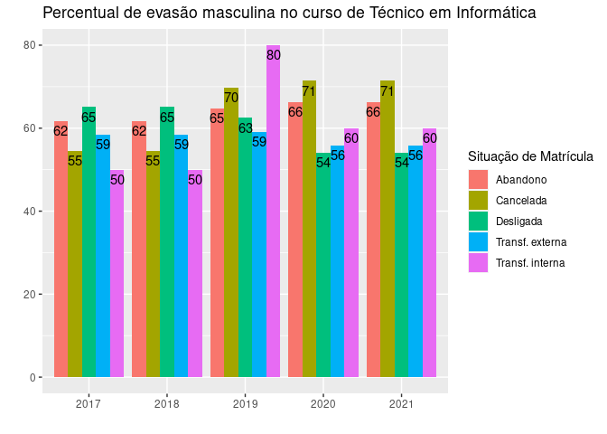

# 1.3 Quantidade de mulheres ainda nos cursos selecionados na pesquisa

``` r
#unique(dado$`Situação de Matrícula`)
situacao_matricula <- c("Em curso")
cursos_selcionados <- c("Técnico em Agrimensura", "Técnico em Edificações", "Técnico em Eletroeletrônica", "Técnico em Informática")

dado_summary1 = dado %>%
  filter(`Nome Curso` %in% cursos_selcionados) %>%
  filter(`Situação de Matrícula` %in% situacao_matricula) %>%
  group_by(ano, `Situação de Matrícula`, `Nome Curso`) %>% 
  mutate(nalunos = n()) %>% 
  group_by(ano, `Situação de Matrícula`, Sexo, `Nome Curso`) %>% 
  summarise(percentual_por_sexo = n() / first(nalunos) * 100) %>% 
  filter(Sexo == "Feminino")
```

    ## `summarise()` has grouped output by 'ano', 'Situação de Matrícula', 'Sexo'. You
    ## can override using the `.groups` argument.

``` r
ggplot(dado_summary1, aes(x = as.factor(ano), y = percentual_por_sexo, fill = `Nome Curso`)) +
  geom_bar(stat = "identity", position = position_dodge()) +
  labs(title = "Percentual de alunas ainda nos cursos selecionados", x = "", y = "") +
  geom_text(aes(label = format(round(percentual_por_sexo, 0), nsmall = 0)), vjust = 1.5, color = "black", position = position_dodge(width = 0.9))
```

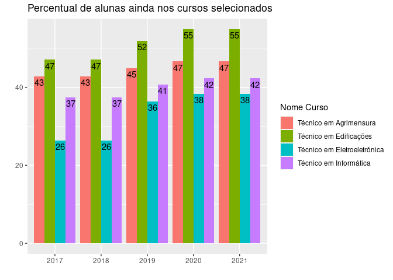

``` r
#unique(dado$`Situação de Matrícula`)
situacao_matricula <- c("Em curso")
cursos_selcionados <- c("Técnico em Agrimensura", "Técnico em Edificações", "Técnico em Eletroeletrônica", "Técnico em Informática")

dado_summary1 = dado %>%
  filter(`Nome Curso` %in% cursos_selcionados) %>%
  filter(`Situação de Matrícula` %in% situacao_matricula) %>%
  group_by(ano, `Situação de Matrícula`, `Nome Curso`) %>% 
  mutate(nalunos = n()) %>% 
  group_by(ano, `Situação de Matrícula`, Sexo, `Nome Curso`) %>% 
  summarise(percentual_por_sexo = n() / first(nalunos) * 100) %>% 
  filter(Sexo == "Masculino")
```

    ## `summarise()` has grouped output by 'ano', 'Situação de Matrícula', 'Sexo'. You
    ## can override using the `.groups` argument.

``` r
ggplot(dado_summary1, aes(x = as.factor(ano), y = percentual_por_sexo, fill = `Nome Curso`)) +
  geom_bar(stat = "identity", position = position_dodge()) +
  labs(title = "Percentual de alunos ainda nos cursos selecionados", x = "", y = "") +
  geom_text(aes(label = format(round(percentual_por_sexo, 0), nsmall = 0)), vjust = 1.5, color = "black", position = position_dodge(width = 0.9))
```

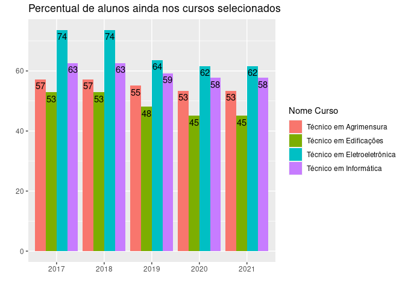

# 1.4 Conclusão do curso pelas mulheres

``` r
#unique(dado_2017$`Situação de Matrícula`)
#unique(dado$`Situação de Matrícula`)
situacao_matricula <- c("Concluída", "Integralizada")
cursos_selcionados <- c("Técnico em Agrimensura", "Técnico em Edificações", "Técnico em Eletroeletrônica", "Técnico em Informática")

dado_summary2 = dado %>%
  filter(`Nome Curso` %in% cursos_selcionados) %>%
  filter(`Situação de Matrícula` %in% situacao_matricula) %>%
  group_by(ano, `Situação de Matrícula`, `Nome Curso`) %>% 
  mutate(nalunos = n()) %>% 
  group_by(ano, `Situação de Matrícula`, Sexo, `Nome Curso`) %>% 
  summarise(percentual_por_sexo = n() / first(nalunos) * 100) %>% 
  filter(Sexo == "Feminino")
```

    ## `summarise()` has grouped output by 'ano', 'Situação de Matrícula', 'Sexo'. You
    ## can override using the `.groups` argument.

``` r
#print(dado_summary)

# Trabalhando com o curso de Técnico em Técnico em Agrimensura

dado_agri <- dado_summary2 %>%
  filter(`Nome Curso` == "Técnico em Agrimensura") %>%
  group_by(`Situação de Matrícula`, percentual_por_sexo)

ggplot(dado_agri, aes(x = as.factor(ano), y = percentual_por_sexo, fill = `Situação de Matrícula`)) +
  geom_bar(stat = "identity", position = position_dodge()) +
  labs(title = "Percentual de conclusão feminina no curso de Técnico em Agrimensura", x = "", y = "") +
  geom_text(aes(label = format(round(percentual_por_sexo, 0), nsmall = 0)), vjust = 1.5, color = "black", position = position_dodge(width = 0.9))
```

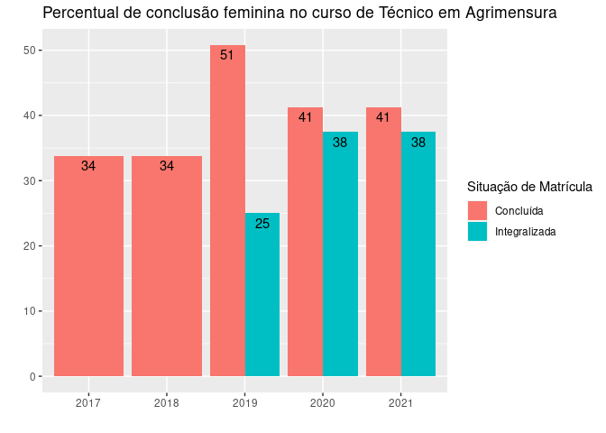

``` r
# Trabalhando com o curso de Técnico em Técnico em Edificações

dado_edi <- dado_summary2 %>%
  filter(`Nome Curso` == "Técnico em Edificações") %>%
  group_by(`Situação de Matrícula`, percentual_por_sexo)

ggplot(dado_edi, aes(x = as.factor(ano), y = percentual_por_sexo, fill = `Situação de Matrícula`)) +
  geom_bar(stat = "identity", position = position_dodge()) +
  labs(title = "Percentual de conclusão feminina no curso de Técnico em Edificações", x = "", y = "") +
  geom_text(aes(label = format(round(percentual_por_sexo, 0), nsmall = 0)), vjust = 1.5, color = "black", position = position_dodge(width = 0.9))
```

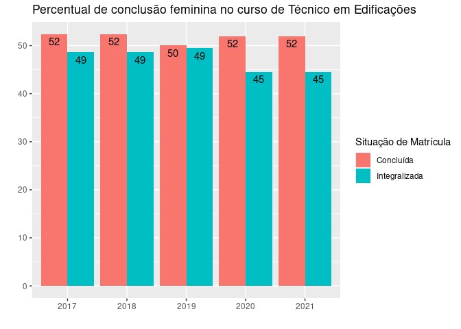

``` r
# Trabalhando com o curso de Técnico em Eletroeletrônica

dado_eletro <- dado_summary2 %>%
  filter(`Nome Curso` == "Técnico em Eletroeletrônica") %>%
  group_by(`Situação de Matrícula`, percentual_por_sexo)

ggplot(dado_eletro, aes(x = as.factor(ano), y = percentual_por_sexo, fill = `Situação de Matrícula`)) +
  geom_bar(stat = "identity", position = position_dodge()) +
  labs(title = "Percentual de conclusão feminina no curso de Técnico em Eletroeletrônica", x = "", y = "") +
  geom_text(aes(label = format(round(percentual_por_sexo, 0), nsmall = 0)), vjust = 1.5, color = "black", position = position_dodge(width = 0.9))
```

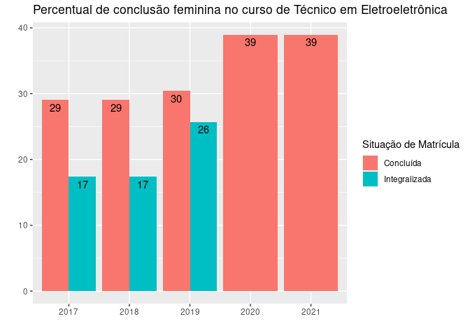

``` r
# Trabalhando com o curso de Técnico em Informática

dado_info <- dado_summary2 %>%
  filter(`Nome Curso` == "Técnico em Informática") %>%
  group_by(`Situação de Matrícula`, percentual_por_sexo)

ggplot(dado_info, aes(x = as.factor(ano), y = percentual_por_sexo, fill = `Situação de Matrícula`)) +
  geom_bar(stat = "identity", position = position_dodge()) +
  labs(title = "Percentual de conclusão feminina no curso de Técnico em Informática", x = "", y = "") +
  geom_text(aes(label = format(round(percentual_por_sexo, 0), nsmall = 0)), vjust = 1.5, color = "black", position = position_dodge(width = 0.9))
```

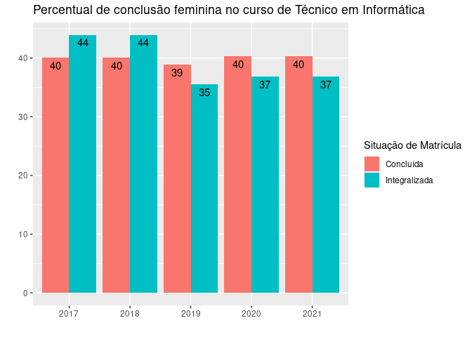

Visualizando a mesma informação para os alunos (representatividade
masculina)

``` r
#unique(dado_2017$`Situação de Matrícula`)
#unique(dado$`Situação de Matrícula`)
situacao_matricula <- c("Concluída", "Integralizada")
cursos_selcionados <- c("Técnico em Agrimensura", "Técnico em Edificações", "Técnico em Eletroeletrônica", "Técnico em Informática")

dado_summary2 = dado %>%
  filter(`Nome Curso` %in% cursos_selcionados) %>%
  filter(`Situação de Matrícula` %in% situacao_matricula) %>%
  group_by(ano, `Situação de Matrícula`, `Nome Curso`) %>% 
  mutate(nalunos = n()) %>% 
  group_by(ano, `Situação de Matrícula`, Sexo, `Nome Curso`) %>% 
  summarise(percentual_por_sexo = n() / first(nalunos) * 100) %>% 
  filter(Sexo == "Masculino")
```

    ## `summarise()` has grouped output by 'ano', 'Situação de Matrícula', 'Sexo'. You
    ## can override using the `.groups` argument.

``` r
#print(dado_summary)

# Trabalhando com o curso de Técnico em Técnico em Agrimensura

dado_agri <- dado_summary2 %>%
  filter(`Nome Curso` == "Técnico em Agrimensura") %>%
  group_by(`Situação de Matrícula`, percentual_por_sexo)

ggplot(dado_agri, aes(x = as.factor(ano), y = percentual_por_sexo, fill = `Situação de Matrícula`)) +
  geom_bar(stat = "identity", position = position_dodge()) +
  labs(title = "Percentual de conclusão masculina no curso de Técnico em Agrimensura", x = "", y = "") +
  geom_text(aes(label = format(round(percentual_por_sexo, 0), nsmall = 0)), vjust = 1.5, color = "black", position = position_dodge(width = 0.9))
```

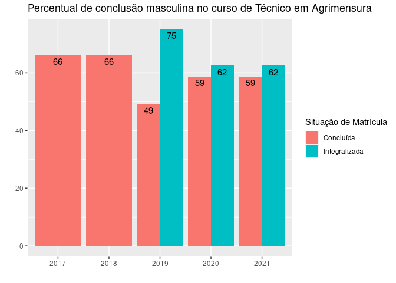

``` r
# Trabalhando com o curso de Técnico em Técnico em Edificações

dado_edi <- dado_summary2 %>%
  filter(`Nome Curso` == "Técnico em Edificações") %>%
  group_by(`Situação de Matrícula`, percentual_por_sexo)

ggplot(dado_edi, aes(x = as.factor(ano), y = percentual_por_sexo, fill = `Situação de Matrícula`)) +
  geom_bar(stat = "identity", position = position_dodge()) +
  labs(title = "Percentual de conclusão masculina no curso de Técnico em Edificações", x = "", y = "") +
  geom_text(aes(label = format(round(percentual_por_sexo, 0), nsmall = 0)), vjust = 1.5, color = "black", position = position_dodge(width = 0.9))
```

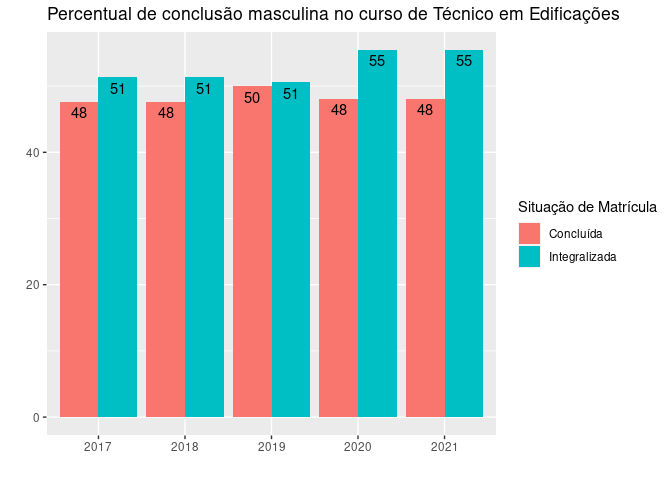

``` r
# Trabalhando com o curso de Técnico em Eletroeletrônica

dado_eletro <- dado_summary2 %>%
  filter(`Nome Curso` == "Técnico em Eletroeletrônica") %>%
  group_by(`Situação de Matrícula`, percentual_por_sexo)

ggplot(dado_eletro, aes(x = as.factor(ano), y = percentual_por_sexo, fill = `Situação de Matrícula`)) +
  geom_bar(stat = "identity", position = position_dodge()) +
  labs(title = "Percentual de conclusão masculina no curso de Técnico em Eletroeletrônica", x = "", y = "") +
  geom_text(aes(label = format(round(percentual_por_sexo, 0), nsmall = 0)), vjust = 1.5, color = "black", position = position_dodge(width = 0.9))
```

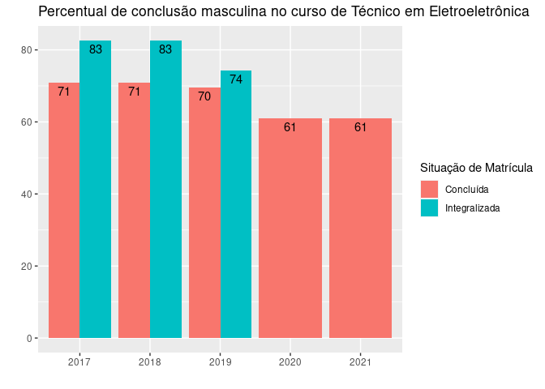

``` r
# Trabalhando com o curso de Técnico em Informática

dado_info <- dado_summary2 %>%
  filter(`Nome Curso` == "Técnico em Informática") %>%
  group_by(`Situação de Matrícula`, percentual_por_sexo)

ggplot(dado_info, aes(x = as.factor(ano), y = percentual_por_sexo, fill = `Situação de Matrícula`)) +
  geom_bar(stat = "identity", position = position_dodge()) +
  labs(title = "Percentual de conclusão masculina no curso de Técnico em Informática", x = "", y = "") +
  geom_text(aes(label = format(round(percentual_por_sexo, 0), nsmall = 0)), vjust = 1.5, color = "black", position = position_dodge(width = 0.9))
```

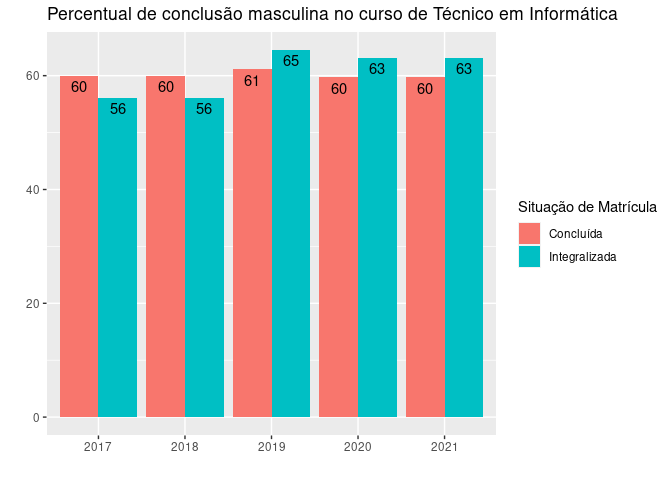
